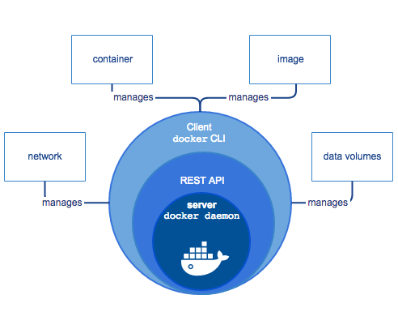
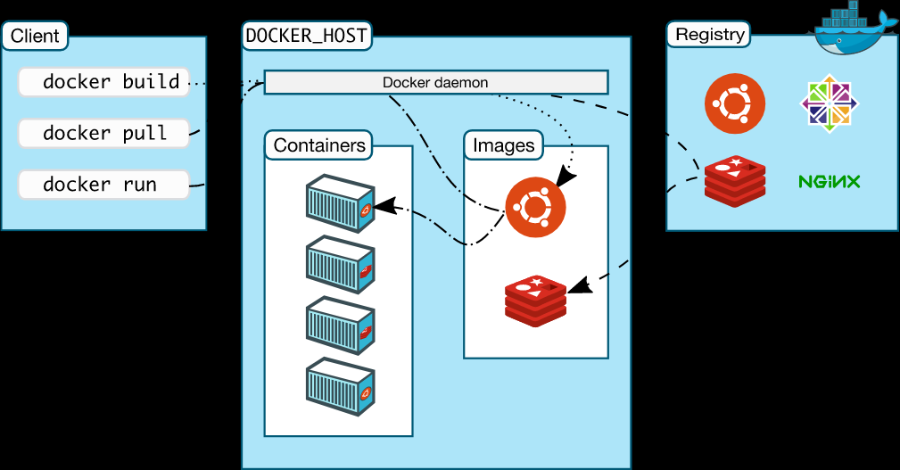

Docker是一个开发，发布和运行应用的开放平台。Docker可以将你的应用从基础设施中分离出来，从而能快速交付。通过Docker，你可以想管理应用一样管理基础设施。通过Docker的优势来快速发布，测试和部署代码，能显著的减少编写代码和在生产环境运行代码的时间差。

### Docker 平台
Docker提供了称之为容器的，能在松散隔离的环境中打包和运行应用程序的能力。这种隔离和安全使得能在给定的主机上运行多个容器。容器是轻量级的，因为他们不需要虚拟机管理程序的额外负载，而是直接运行在主机的内核中。这意味着，如果你使用了虚拟机，那么可以在给定的硬件组合上运行更多的容器。甚至于，你能在实际是虚拟机的主机中运行docker容器。

docker提供了工具和平台来管理容器的生命周期：

- 使用容器开发应用程序和其相关的支持组件
- 容器成为分配和测试应用程序的基本单元。
- 准备就绪后，将应用程序容器或者服务编排部署到生产环境。不管生产环境是本地的数据中心，还是云提供商，还是两者的混合，这都是一样的。

### Docker引擎
Docker引擎是一个包含了一下主要组件的 客户端-服务器(client-server) 应用程序：

- 服务器，一个称之为守护进程的长期运行的程序(dockerd 命令)
- REST API，指定程序与守护进程通讯的接口，并指示它做什么操作。
- 命令行接口客户端(CLI,command line interface)（docker命令）



CLI使用Docker REST API，通过脚本或直接的CLI命令，来控制守护进程或与其进行交互。很多其他的docker应用使用底层的API和CLI。

守护进程创建并管理docker对象，比如镜像(images)，容器(containers)，网络(networks)以及卷(volumns)

NOTE: docker使用开源的Apache 2.0许可证

### docker能用来做什么

##### 快速，一致性的交互应用程序
docker通过允许开发者，使用提供应用程序和服务的本地容器，的标准化环境中工作来简化开发流程。容器对于持续集成和持续开发非常有用(CI/CD)。

考虑以下示例场景：

- 开发者本地编码并通过docker容器与同事分享他们的工作。
- 使用docker推送他们的应用程序到测试环境，并自动和手动执行测试。
- 当开发人员发现bug，他们能在开发环境修复这些bug，然后重新部署到测试环境进行测试和验证。
- 测试完成后，将修复后的程序推送给客户就如同将更新的镜像推送到生产环境一样简单。

##### 响应式部署和缩放
docker，基于容器的平台允许高可移植的工作负载。docker容器能运行在开发者的本地机器上，数据中心的物理或者虚拟机上，云提供商上，或者在一个混合的环境。

docker的可移植性和轻量级的特性，也使得它很容易动态的管理工作负载，按照业务需求，近乎实时地扩大或缩小应用程序和服务。

##### 在同样的硬件上运行更多的工作负载
docker是轻量级的并且快速的。它为基于虚拟机管理程序的虚拟机提供了一个可行的，经济高效的替代方案，所以能使用更多的计算能力来达成业务目标。

docker完美契合于需要用更少的资源来做更多事情的高密度环境和中小型部署。

### docker体系结构
docker使用客户端-服务器(client-server)的体系结构。docker客户端与docker守护进程交互，docker守护进程负责构建，运行和分发docker容器。docker客户端和docker守护进程能运行在同一系统上，也可以将docker客户端连接到远程docker守护进程。docker客户端和docker守护进程使用REST API，通过Unix套接字或者网络接口进行通信。



#### docker 守护进程
docker守护进程(```dockerd```)监听docker API请求，管理docker对象，诸如镜像，容器，网络和卷。守护进程也可以跟其他守护进程进行通信来管理docker服务。

#### docker客户端
docker客户端(```docker```)是许多docker用于与docker进行交互的主要方式。当使用比如```docker run```这样的命令时，客户端就发送了这些命令到```dockerd```，由dockerd将命令传送出去。```docker```命令使用docker API。一个docker客户端能与多个守护进程进行通信。

#### docker 注册表
docker注册表存储docker镜像。Docker Hub 和 Docker Cloud 是任何人都能使用的注册中心，docker的默认配置也是从Docker Hub寻找镜像。也可以运行自己私有的注册中心。如果使用docker数据中心(Docker Datacenter (DDC)),它已经包含了docker受信的注册中心(Docker Trusted Registry (DTR))

当使用```docker pull``` 或者 ```docker run```命令时，需要的镜像会从配置的注册中心拉取。当使用```docker push```命令时，镜像也会推送到配置的注册中心。

docker 商店(docker store)允许用户购买和销售docker镜像，或者免费发布。比如，你可以从软件供应商那购买一个包含了应用程序或服务的镜像，然后使用该镜像部署应用程序到测试环境，演练环境以及生产环境。你也可以拉取最新版本的镜像并重新部署容器，来升级你的应用程序。

#### docker 对象
当使用docker的时候，也就是在创建和使用镜像，容器，网络，卷，插件和其他一些对象。这部分是对这些对象的简要介绍

##### 镜像（IMAGES）
镜像是一个带有创建docker容器说明的只读模板。通常，镜像是基于另外的镜像，并添加一些额外的自定义。比如，你可以构建一个基于```ubuntu```镜像的镜像，但是会额外安装Apache Web服务器和应用程序，以及能使应用程序运行的详细配置。

你可以创建属于自己的镜像，或者仅仅使用别人创建好并推送到注册中心的镜像。要构建自己的镜像，需要创建一个语法简单的，定义了创建和运行镜像所需要的步骤的*dockerfile*文件。Dockerfile中的每条指令都会创建一个镜像层。当变更Dockerfile文件重新构建镜像时，只有需要变更的镜像层才会重新构建。这也是相对于其他虚拟技术，镜像如此轻量级，微小，快速的一部分原因。

##### 容器（CONTAINERS）
容器是可运行的镜像实例。可以通过Docker API或者CLI创建，运行，停止，移动或者删除容器。一个容器可以连接到一个或多个网络，将连接存储到它，甚至可以基于当前状态创建一个新镜像。

默认情况下，一个容器与其他容器以及宿主机是相对隔离的。可以控制容器的网络，存储或其他底层子系统，与其他容器或宿主机的隔离程度。

容器由镜像定义，以及其他任何在创建或启动时提供的配置选项。当容器被移除时，任何没有持久化的变更都将消失。

##### ```docker run```命令举例
如下命令运行了一个Ubuntu容器，以交互方式添加到本地命令行会话，并运行```/bin/bash```

	$ docker run -i -t ubuntu /bin/bash
当运行这个命令时，实际发生了一下的过程：（假设使用默认的注册中心配置）

1. 如果本地没有```Ubuntu```镜像，Docker会从配置的注册中心拉取，就好像自己手动运行了```docker pull ubuntu```命令一样。
2. Docker会创建一个新的容器，就想手动运行```docker create```命令一样
3. Docker将一个读写文件系统分配给容器，作为它的最外层。这使得一个运行中的容器可以在它的本地文件系统创建或修改文件和文件夹。
4. 由于没有指定任何网络选项，所以Docker会创建一个网络接口来将容器连接到默认网络。这包括分配一个IP地址给容器。默认情况下，容器可以通过使用宿主机的网络连接，连接到外部网络。
5. Docker启动容器并执行```/bin/bash```.由于容器是交互式运行的，并且连接到终端（因为-i 和-t）,可以使用键盘提供输入，并将输出结果记录到终端。
6. 当输入```exit```来终止```/bin/bash```命令，容器会停止但不会移除。可以重新启动或者移除。

##### 服务(SERVICES)
通过服务，可以跨多个Docker守护进程扩展容器，这些守护进程可以作为一个拥有多个管理员和工作者的集群(swarm)一起工作。集群中的每一个成员是一个Docker守护进程，并且这些守护进程通过Docker API进行通信。服务允许定义所需的状态，例如在任何给定时间必须可用的服务副本数量。默认情况下，服务在所有工作节点之间进行负载均衡。对于消费者而言，docker服务似乎是一个单一的应用程序。Docker引擎在1.12及更高的版本支持集群(swarm)模式。

### 基础技术(The underlying technology)
Docker使用Go编写的，利用Linux内核的几个特性来提供它的功能

#### 命名空间(Namespaces)
Docker使用称为命名空间(Namespaces)的技术来提供称为容器(container)的独立工作空间。当运行一个容器时，Docker为该容器创建一组命名空间。

这些命名空间提供了一个隔离层。容器的每一个方面都在一个独立的命名空间中运行，并且访问受限于该命名空间。

Docker引擎在Linux上使用如下的命名空间：

+ **pid命名空间**：进程隔离(PID=process id)
+ **net命名空间**：管理网络接口(NET=networking)
+ **ipc命名空间**：管理对IPC资源的访问(IPC=InterProcess Communication)
+ **mnt命名空间**：管理文件系统挂载点(MNT=mount)
+ **uts命名空间**：隔离内核和版本标志符(UTS=unix timesharing system)

#### 控制组(control groups)
在Linux上，Docker引擎也需要另外一种称为控制组(cgroups)的技术。