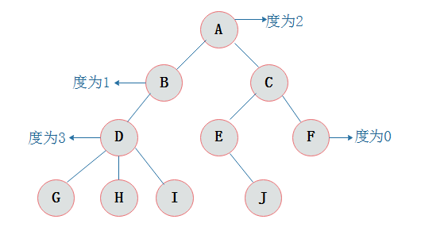

https://www.cnblogs.com/maybe2030/p/4732377.html

树的基本概念：

- 节点
- 度: 节点所拥有的子树的个数称为 度
- 高度/深度：树中结点的最大层次数称为树的深度或高度。图示树的深度为4。

 

二叉树遍历分为三种：前序、中序、后序

- 前序遍历：根节点排最先，然后同级先左后右
- 中序遍历：先左后根最后右
- 后序遍历：先左后右最后根

上图遍历结果：
> - 前序遍历：ABCDEFGHK
> - 中序遍历：BDCAEHGKF
> - 后序遍历：DCBHKGFEA

### 二叉树
> - 每个结点都最多只有两个子结点的树(不存在度大于2的结点)
> - 二叉树的子树有左右之分，次序不能颠倒
> - 二叉树的第i层至多有 2i-1 个结点
> - 深度为k的二叉树至多有 2k-1 个结点
	> 所谓最多，即满二叉树的情况
> - 对任何一棵二叉树T，如果其终端结点数为n0，度为2的结点数为n2，则n0=n2+1
> - 给定N个节点，能构成h(N)种不同的二叉树，其中h(N)为卡特兰数的第N项，h(n)=C(2*n, n)/(n+1)
> - 设有i个枝点，I为所有枝点的道路长度总和，J为叶的道路长度总和J=I+2i

### 满二叉树
> - 除最后一层无任何子节点外，每一层上的所有结点都有两个子结点，节点数达到最大值，所有叶子结点必须在同一层上
> - 一颗树深度为h，最大层数为k，深度与最大层数相同，k=h;
> - 叶子数为2k;
> - 第k层的结点数是：2k-1;
> - 总结点数是：2k-1，且总节点数一定是奇数(根节点)

### 完全二叉树
> - 若设二叉树的深度为h，除第 h 层外，其它各层 (1～(h-1)层) 的结点数都达到最大个数，第h层所有的结点都连续集中在最左边
> - 具有n个结点的完全二叉树的深度为log2(n+1)
> - 设 有N个结点的完全二叉树各结点，用顺序方式存储，则结点之间有如下关系
	- 若I为结点编号则 如果I>1，则其父结点的编号为I/2；
	- 如果2I<=N，则其左儿子（即左子树的根结点）的编号为2I；若2I>N，则无左儿子；
	- 如果2I+1<=N，则其右儿子的结点编号为2I+1；若2I+1>N，则无右儿子。

### 平衡二叉树(AVL)
> 任一结点的左右子树的高度差绝对值不超过1，且左右子树均为平衡二叉树（防止树退化成链表）

### 二叉查找树(BST)
> - 又称为是二叉排序树或二叉搜索树
> - 若左子树不空，则左子树上所有结点的值均小于它的 **根结点** 的值
> - 若右子树不空，则右子树上所有结点的值均大于或等于它的 **根结点** 的值
> - 左、右子树也分别为二叉排序树
> - 没有键值相等的节点
> - 对二叉查找树进行中序遍历，即可得到有序的数列
> - 它和二分查找一样，插入和查找的时间复杂度均为O(logn)，但是在最坏的情况下仍然会有O(n)的时间复杂度(退化成 链表 )
> 
>  二叉查找树的插入过程如下
>>  - 若当前的二叉查找树为空，则插入的元素为根节点;
 >  - 若插入的元素值小于根节点值，则将元素插入到左子树中;
 >  - 若插入的元素值不小于根节点值，则将元素插入到右子树中
>
>  二叉查找树的删除，分三种情况进行处理(基于中序遍历)
>>  - p为叶子节点，直接删除该节点，再修改其父节点的指针（注意分是根节点和不是根节点）
 >  - p为单支节点（即只有左子树或右子树）。让p的子树与p的父亲节点相连，删除p即可（注意分是根节点和不是根节点）
 >  - p的左子树和右子树均不空。找到p的后继y，因为y一定没有左子树，所以可以删除y，并让y的父亲节点成为y的右子树的父亲节点，并用y的值代替p的值；或者方法二是找到p的前驱x，x一定没有右子树，所以可以删除x，并让x的父亲节点成为y的左子树的父亲节点

### 平衡二叉查找树之AVL树

- 在AVL中任何节点的两个子树的高度最大差别为1，所以它也被称为高度平衡树

### 平衡二叉树之红黑树
- 它的操作有着良好的最坏情况运行时间，并且在实践中是高效的: 它可以在O(logn)时间内做查找，插入和删除，这里的n是树中元素的数目
- 性质：
	- 节点是红色或黑色
	- 根是黑色
	- 所有叶子都是黑色（叶子是NIL节点）
	- 每个红色节点必须有两个黑色的子节点。(从每个叶子到根的所有路径上不能有两个连续的红色节点。)
	- 从任一节点到其每个叶子的所有简单路径都包含相同数目的黑色节点

